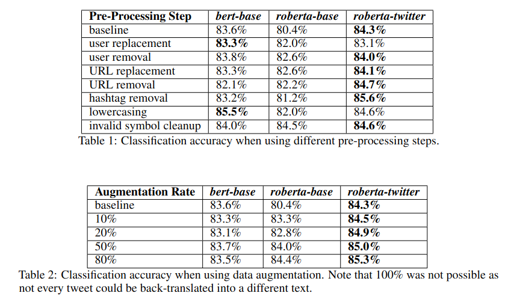

# Disaster Tweet Classification
This is the repository for a mini-project where we classify whether a tweet is discussing a disastrous event (e.g flood)
or not (see [dataset](https://www.kaggle.com/competitions/nlp-getting-started/overview) for details). We use a number
of pre-trained transformer models such as BERT and RoBERTa and perform an ablation study on how these models perform
with various degrees of preprocessing. Additionally, we also studied the effect of data augmentation via back translation
on the models and could generally observe an increase in performance:

For more details, see the [report](docs/report.pdf).

## Installation & Running
To run the code: 
1. Install Python 3.9+ and jupyter notebook. 
2. Run `all_models.ipynb` which will install the remaining
dependencies.

